# ⚡ Industrial Smart Grid AI

> A distributed AI-powered smart grid simulation and real-time monitoring system.
> Multiple devices stream live electrical telemetry to a central AI server that runs
> anomaly detection, health scoring, fault isolation, predictive maintenance, and
> automatic load balancing — all displayed on a live React dashboard.

[](https://python.org)
[](https://fastapi.tiangolo.com)
[](https://react.dev)
[](https://scikit-learn.org)

---

## Table of Contents

1. [What This System Does](#1-what-this-system-does)
2. [End-to-End System Flow](#2-end-to-end-system-flow)
3. [System Architecture](#3-system-architecture)
4. [Data Sources — Where S1/S2/S3 Data Comes From](#4-data-sources)
5. [Communication Protocol](#5-communication-protocol)
6. [AI Pipeline — Step by Step](#6-ai-pipeline)
7. [All ML Models](#7-all-ml-models)
8. [Health Score System](#8-health-score-system)
9. [Load Balancing & Self-Healing](#9-load-balancing--self-healing)
10. [Alert System](#10-alert-system)
11. [Quick Start](#11-quick-start)
12. [Distributed Multi-Device Setup](#12-distributed-multi-device-setup)
13. [Android Phone via ADB — Step by Step](#13-android-phone-via-adb)
14. [Arduino / ESP32 via USB — Step by Step](#14-arduino--esp32-via-usb)
15. [API Reference](#15-api-reference)
16. [Dashboard](#16-dashboard)
17. [Project Structure](#17-project-structure)
18. [Configuration](#18-configuration)
19. [Docker Deployment](#19-docker-deployment)
20. [Tech Stack](#20-tech-stack)

---

## 1. What This System Does

This project simulates a real industrial smart grid where multiple devices act as virtual electrical substations. Each device streams live sensor data to a central AI server that:

- Detects anomalies using **IsolationForest** (point-based) and **LSTM** (sequence/trend-based)
- Calculates a **health score (0–100)** for each substation every 1.5 seconds
- Classifies **fault types** (overheat, voltage sag, overload, harmonics, overcurrent)
- **Predicts overload** risk in the next 5 readings using RandomForest
- **Predicts transformer failure** probability over 24 hours using Logistic Regression
- **Automatically redistributes load** away from failing substations
- **Self-heals** by gradually restoring load as substations recover
- Sends **Email / Slack / SMS alerts** on critical events
- Displays everything on a **live React dashboard** with real-time charts

Think of it as a miniature SCADA + predictive maintenance platform.

---

## 2. End-to-End System Flow

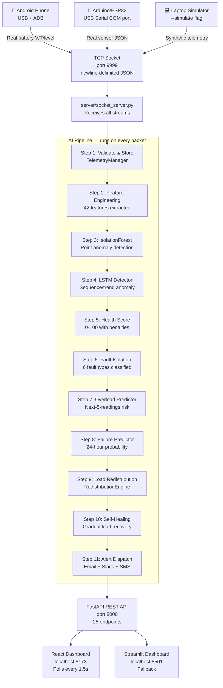

---

## 3. System Architecture

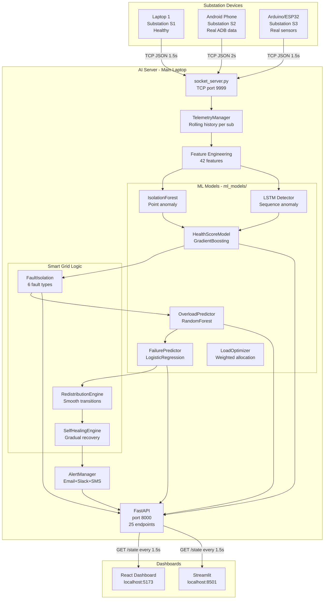

---

## 4. Data Sources

**S1, S2, S3 are substation IDs** — labels you assign to each device. The actual data comes from whichever hardware you connect.

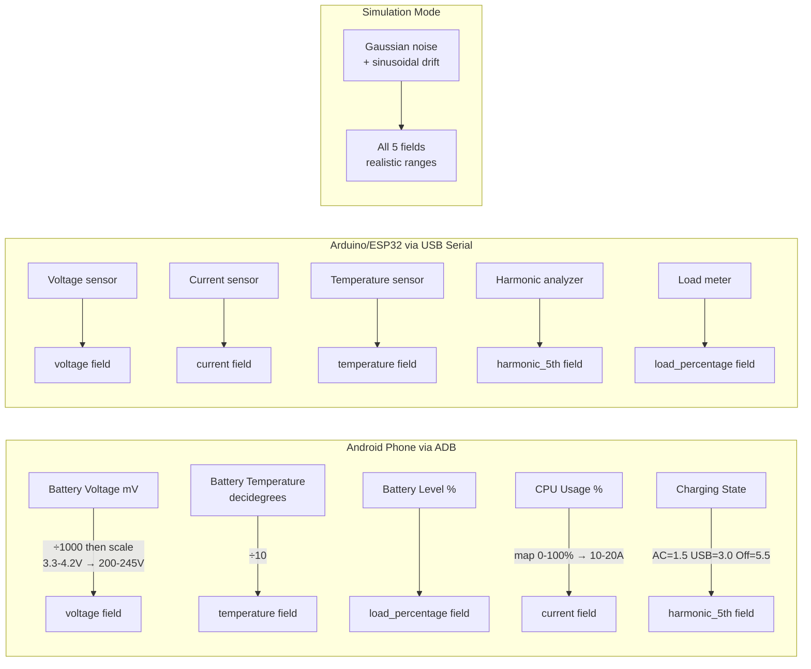

### Normal Operating Ranges

| Metric | Healthy Range | Warning | Critical |
|---|---|---|---|
| Voltage | 220–240 V | < 210V or > 245V | < 200V or > 250V |
| Current | 10–20 A | > 18A | > 22A |
| Temperature | 50–75 °C | > 75°C | > 85°C |
| Harmonics | 1–5 % | > 5% | > 8% |
| Load | 20–60 % | > 60% | > 80% |

---

## 5. Communication Protocol

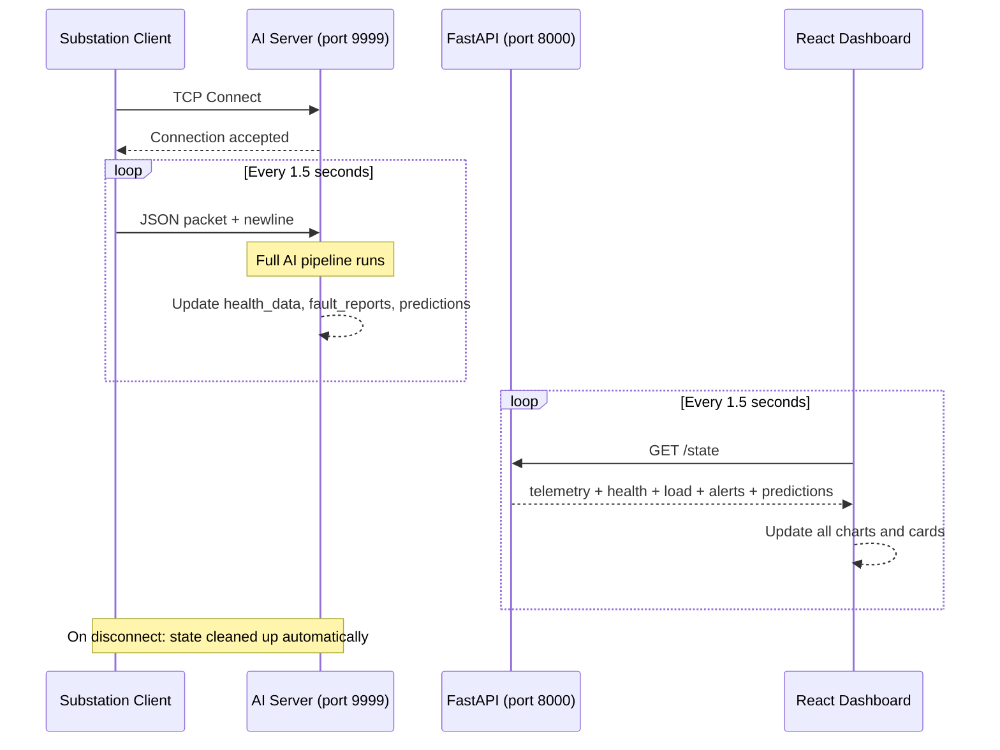

### Packet Format

```json
{
  "substation_id":   "S1",
  "timestamp":       "2026-05-19T22:00:00.000000",
  "voltage":         230.5,
  "current":         14.2,
  "temperature":     62.1,
  "harmonic_5th":    3.5,
  "load_percentage": 35.0
}
```

Fields may be `null` — the AI pipeline handles partial sensor data gracefully.

---

## 6. AI Pipeline

Every telemetry packet triggers this full pipeline in under 50ms:

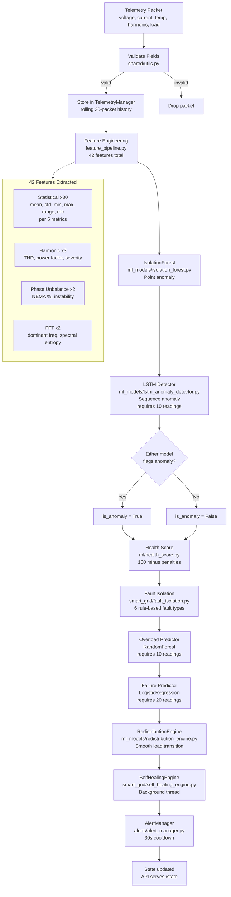

### Step-by-Step Explanation

**Step 1 — Validate & Store**
Every packet is checked for required fields. Valid packets go into `TelemetryManager` which keeps the latest reading and a 20-packet rolling history per substation.

**Step 2 — Feature Engineering (42 features)**
Raw 5 values are expanded to 42 features:
- 30 statistical features (mean, std, min, max, range, rate-of-change × 5 metrics)
- 3 harmonic features (THD approximation, power factor estimate, severity index)
- 2 phase unbalance features (NEMA unbalance %, voltage instability coefficient)
- 2 FFT features (dominant frequency magnitude, spectral entropy)

**Step 3 — IsolationForest (point anomaly)**
Trained on 500 synthetic normal samples at startup. Saved to disk, reloaded on restart. Phone battery voltage (< 10V) is auto-neutralised to prevent false positives.

**Step 4 — LSTM Detector (sequence anomaly)**
One detector per substation. Looks at the last 10 readings as a sequence. Catches gradual drift that looks normal point-by-point but is anomalous as a trend. Combined with IsolationForest: anomaly if either model flags it.

**Step 5 — Health Score**
Starts at 100, applies rule-based penalties. −30 if ML anomaly detected. Score determines status: Healthy (80–100), Warning (50–79), Critical (0–49).

**Step 6 — Fault Isolation**
Six rule-based fault types: Overheat, Voltage Sag, Voltage Surge, Overload, Harmonic Distortion, Overcurrent. Multiple faults can fire simultaneously.

**Step 7 — Overload Prediction**
RandomForest trained on 1500 synthetic sequences. Predicts overload risk in the next 5 readings. Triggers a WARNING alert if probability > 75%.

**Step 8 — Transformer Failure Prediction**
Logistic Regression trained on 2000 sequences. Predicts 24-hour failure probability from 17 stress features (thermal cycles, voltage sag count, harmonic stress, etc.).

**Step 9 — Load Redistribution**
`RedistributionEngine` detects status changes, calls `LoadOptimizer` for optimal distribution, applies it gradually over 10 seconds (5 steps × 2s) with 15-second cooldown.

**Step 10 — Self-Healing**
Background thread checks every 10 seconds. When health rises above 70, load is restored +5% per cycle until the substation reaches its fair share.

**Step 11 — Alert Dispatch**
CRITICAL alerts trigger Email + Slack + SMS in parallel background threads. 30-second cooldown per substation prevents spam.

---
## 7. All ML Models

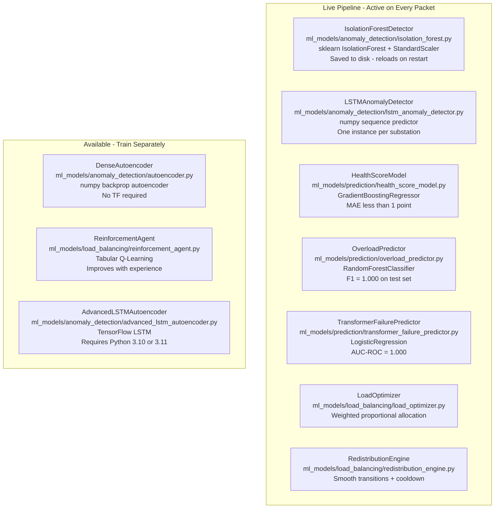

### Train all models manually

```bash
# Train and save all anomaly detection models to ml_models/saved_models/
python ml_models/anomaly_detection/model_trainer.py
```

Models are auto-loaded from disk on server restart — no retraining needed.

### Model persistence

All models save to `ml_models/saved_models/` using joblib:

```
ml_models/saved_models/
├── isolation_forest.joblib
├── isolation_forest_scaler.joblib
├── lstm_detector.joblib
├── autoencoder_weights.joblib
├── health_score_model.joblib
├── overload_predictor.joblib
├── transformer_failure_predictor.joblib
├── transformer_failure_scaler.joblib
└── rl_q_table.joblib
```

---

## 8. Health Score System

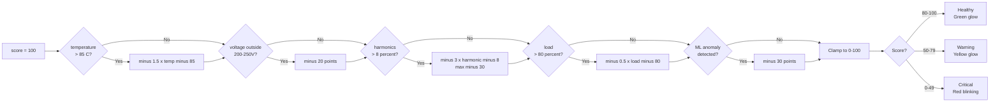

### Example calculations

| Scenario | Penalties | Final Score | Status |
|---|---|---|---|
| All normal, no anomaly | 0 | 100 | Healthy |
| Temp=90°C | −7.5 | 92.5 | Healthy |
| Temp=112°C + anomaly | −40.5 − 30 | 29.5 | Critical |
| Voltage=178V + anomaly | −20 − 30 | 50 | Warning |
| All faults combined | −40.5 − 20 − 18 − 6 − 30 | 0 | Critical |

---

## 9. Load Balancing & Self-Healing

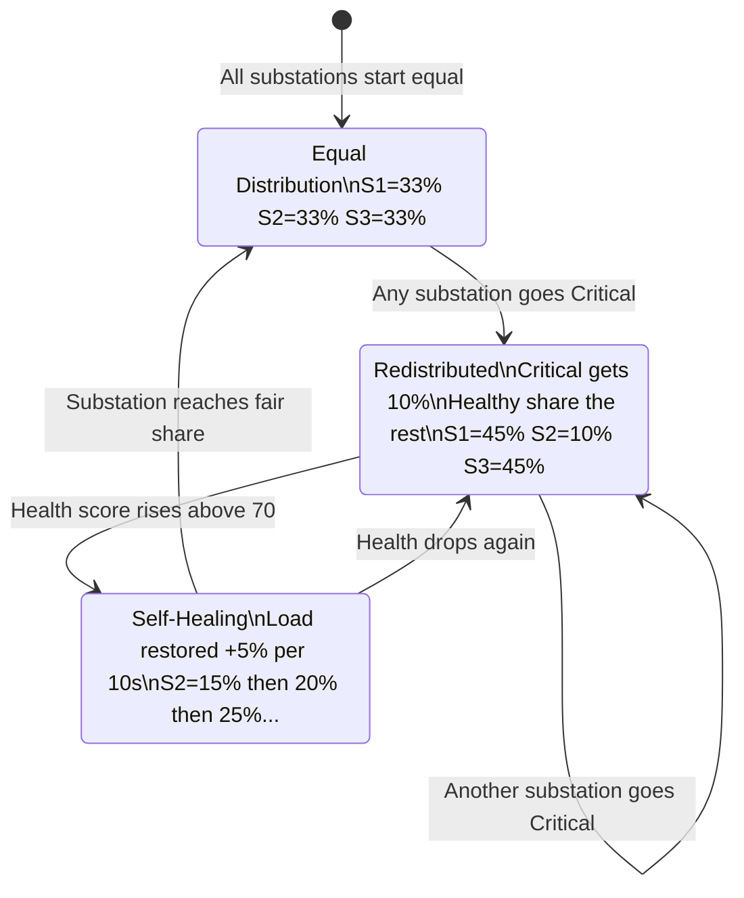

### Load redistribution formula

```
Critical substations  → floor load = 10%
Remaining load        = 100% - (count_critical × 10%)
Warning substations   → 60% of healthy share
Healthy substations   → remaining / (n_healthy + 0.6 × n_warning)
```

### Self-healing timeline example

```
t=0s:   S2 Critical → load = 10%
t=30s:  S2 health = 72 → healing starts
t=40s:  S2 load = 15%
t=50s:  S2 load = 20%
t=60s:  S2 load = 25%
t=70s:  S2 load = 30%
t=80s:  S2 load = 33.3% → fully recovered
```

---

## 10. Alert System

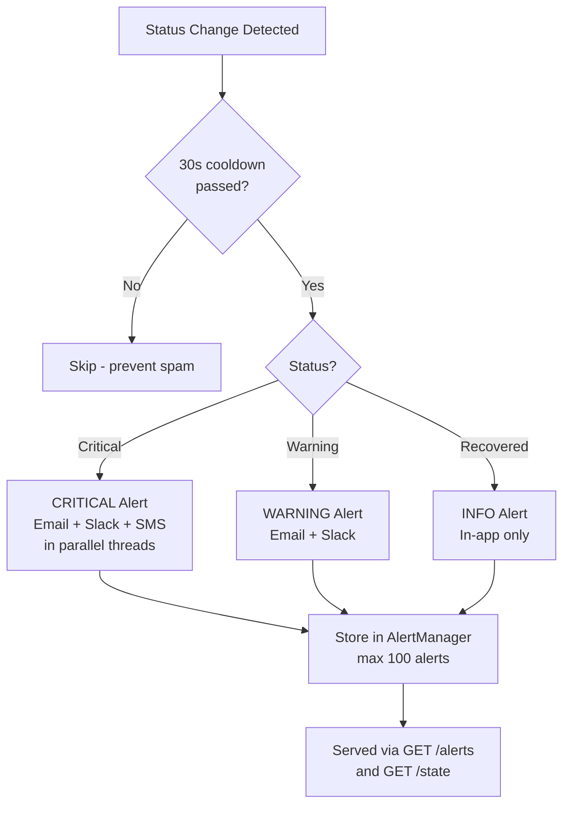

### Configure in `.env`

```env
# Email (SMTP)
ALERT_EMAIL_FROM=sender@gmail.com
ALERT_EMAIL_TO=ops@yourcompany.com
ALERT_EMAIL_PASSWORD=your_app_password
ALERT_SMTP_HOST=smtp.gmail.com
ALERT_SMTP_PORT=587

# Slack webhook
SLACK_WEBHOOK_URL=https://hooks.slack.com/services/T.../B.../...

# SMS via Twilio
TWILIO_ACCOUNT_SID=ACxxxxxxxxxxxxxxxxxxxxxxxxxxxxxxxx
TWILIO_AUTH_TOKEN=your_auth_token
TWILIO_FROM_NUMBER=+1xxxxxxxxxx
TWILIO_TO_NUMBER=+1xxxxxxxxxx
```

Channels are silently skipped if credentials are not set — the system works without them.

---

## 11. Quick Start

### Prerequisites

```bash
# Python 3.10+ (tested on 3.14.3)
pip install -r requirements.txt

# Node.js 18+ for the React dashboard
cd dashboard/frontend
npm install
cd ../..
```

### Option A — Demo mode (no hardware needed)

```bash
python start_all.py --simulate
```

This starts:
- FastAPI backend on port 8000
- 3 simulated substations (S1 healthy, S2 faulty, S3 healthy)
- React dashboard on port 5173
- Streamlit dashboard on port 8501

### Option B — With Android phone

```bash
# Start server + dashboard only
python start_all.py --server-only

# In a separate terminal, run the ADB client
python substations/substation_client.py --id S1 --source adb
```

### Option C — With USB sensor

```bash
# Start server + dashboard
python start_all.py --server-only

# In a separate terminal, connect your sensor
python substations/substation_client.py --id S1
```

### Open the dashboard

| URL | What |
|---|---|
| http://localhost:5173 | React dashboard (primary) |
| http://localhost:8000/docs | Swagger API docs |
| http://localhost:8501 | Streamlit dashboard (fallback) |

---

## 12. Distributed Multi-Device Setup

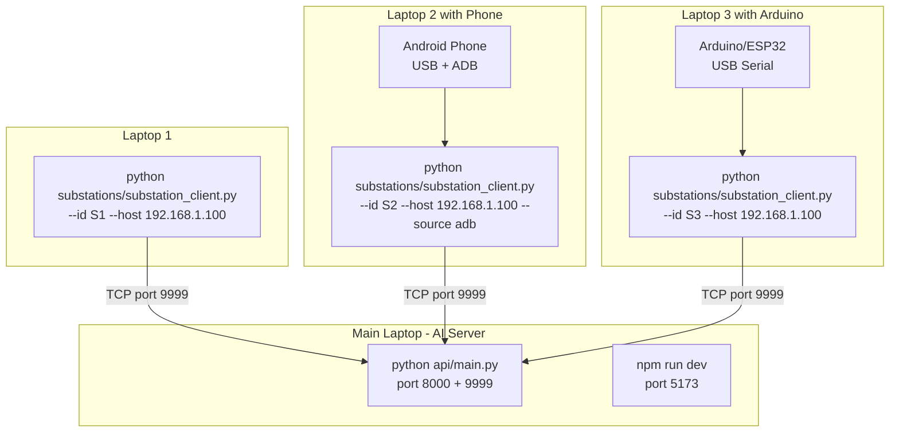

### Steps

**Step 1 — On the main laptop (AI server)**

```bash
pip install -r requirements.txt
python api/main.py
# Note your IP: ipconfig (Windows) or ifconfig (Mac/Linux)
# Example: 192.168.1.100
```

**Step 2 — On each substation laptop**

```bash
pip install -r requirements.txt

# USB sensor (auto-detect port):
python substations/substation_client.py --id S1 --host 192.168.1.100

# Android phone:
python substations/substation_client.py --id S2 --host 192.168.1.100 --source adb

# Simulation:
python substations/substation_client.py --id S3 --host 192.168.1.100 --simulate
```

**Step 3 — Start the dashboard on the main laptop**

```bash
cd dashboard/frontend && npm run dev
# Open http://localhost:5173
```

---

## 13. Android Phone via ADB

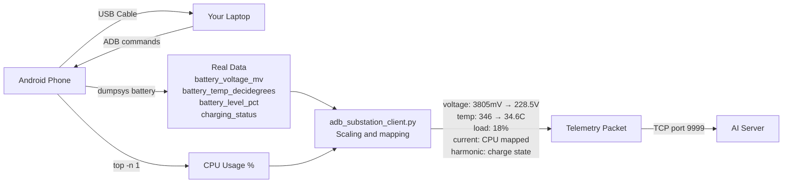

### Step-by-step setup

**1. Enable USB Debugging on your phone**

```
Settings → About Phone → tap Build Number 7 times
Settings → Developer Options → USB Debugging → ON
```

**2. Connect phone via USB cable**

**3. Accept the prompt on your phone screen**

```
"Allow USB Debugging from this computer?" → ALLOW
```

**4. Verify connection**

```bash
python list_usb_ports.py
# or
platform-tools/adb.exe devices
# Should show: XXXXXXXX  device
```

**5. Run the ADB client**

```bash
python substations/substation_client.py --id S1 --source adb
```

**6. Expected terminal output**

```
[S1] Phone connected: XXXXXXXX
[S1] Phone → BattV=3.805V→GridV=228.5V | Temp=34.6°C | Batt=18% | CPU=23% | Charging (USB)
[S1] Phone → BattV=3.801V→GridV=228.1V | Temp=34.7°C | Batt=18% | CPU=31% | Charging (USB)
```

**7. Dashboard shows** `📱 Android ADB` badge on the substation card

**ADB not installed?**

```bash
python setup_adb.py
# Auto-downloads ADB to platform-tools/
```

---

## 14. Arduino / ESP32 via USB

### Arduino firmware

Upload this sketch to your board:

```cpp
void setup() {
  Serial.begin(9600);
}

void loop() {
  // Replace with real sensor readings from your hardware
  float voltage     = 230.0 + random(-5, 5);
  float current     = 15.0  + random(-2, 2);
  float temperature = 62.0  + random(-3, 3);
  float harmonic    = 3.5;
  float load        = 40.0  + random(-5, 5);

  Serial.print("{\"voltage\":");
  Serial.print(voltage, 2);
  Serial.print(",\"current\":");
  Serial.print(current, 2);
  Serial.print(",\"temperature\":");
  Serial.print(temperature, 2);
  Serial.print(",\"harmonic_5th\":");
  Serial.print(harmonic, 2);
  Serial.print(",\"load_percentage\":");
  Serial.print(load, 2);
  Serial.println("}");

  delay(1500);
}
```

### Connect and stream

```bash
# List available COM ports
python substations/substation_client.py --list-ports

# Auto-detect port
python substations/substation_client.py --id S1

# Specify port explicitly
python substations/substation_client.py --id S1 --port-name COM3
python substations/substation_client.py --id S1 --port-name /dev/ttyUSB0

# Custom baud rate
python substations/substation_client.py --id S1 --port-name COM3 --baud 115200
```

### Expected terminal output

```
[S1] USB serial opened: COM3 @ 9600 baud
[S1] Connected to AI server at localhost:9999
[S1] Sent: voltage=230.5 current=14.2 temperature=62.1 harmonic=3.5 load=40.0
```

---

## 15. API Reference

Base URL: `http://localhost:8000`
Interactive docs: http://localhost:8000/docs

### System

| Method | Endpoint | Description |
|---|---|---|
| GET | `/` | Health check — returns `{"status": "ok"}` |
| GET | `/state` | Full grid state — polled by dashboard every 1.5s |
| GET | `/summary` | System health summary with counts |

### Telemetry

| Method | Endpoint | Description |
|---|---|---|
| GET | `/telemetry/` | Latest telemetry for all substations |
| GET | `/telemetry/{sub_id}` | Latest telemetry for one substation |
| GET | `/telemetry/{sub_id}/history` | Rolling history (last 20 packets) |

### Anomaly & Health

| Method | Endpoint | Description |
|---|---|---|
| GET | `/anomaly/health` | Health scores for all substations |
| GET | `/anomaly/health/{sub_id}` | Health score for one substation |
| GET | `/anomaly/summary` | Overall system health summary |
| GET | `/anomaly/faults` | Fault reports for all substations |
| GET | `/anomaly/faults/{sub_id}` | Fault report for one substation |

### Load Balancing

| Method | Endpoint | Description |
|---|---|---|
| GET | `/load/distribution` | Current load distribution |
| GET | `/load/substations` | List of active substations |
| POST | `/load/rebalance` | Trigger manual rebalance |

### Prediction & Explainability

| Method | Endpoint | Description |
|---|---|---|
| POST | `/predict/anomaly` | Point anomaly detection on a packet |
| POST | `/predict/root-cause` | Root cause analysis on a packet |
| GET | `/predict/model-info` | Info on all active ML models |
| GET | `/predict/overload/{sub_id}` | Overload risk from rolling history |
| GET | `/predict/failure/{sub_id}` | Transformer failure probability |
| GET | `/predict/all/{sub_id}` | All live predictions for a substation |
| POST | `/predict/optimize-load` | Optimal load distribution recommendation |

### Alerts

| Method | Endpoint | Description |
|---|---|---|
| GET | `/alerts` | Alert feed (latest 20) |
| GET | `/alerts/{sub_id}` | Alerts for one substation |
| DELETE | `/alerts` | Clear all alerts |

### USB

| Method | Endpoint | Description |
|---|---|---|
| GET | `/usb/status` | Connected USB devices + active substations |
| GET | `/usb/ports` | List all available COM/serial ports |

### Example `/state` response

```json
{
  "telemetry": {
    "S1": {"voltage": 230.5, "current": 14.2, "temperature": 62.1, "harmonic_5th": 3.5, "load_percentage": 35.0}
  },
  "health": {
    "S1": {"health_score": 100.0, "risk_level": "Healthy", "anomaly_detected": false, "anomaly_score": 0.12}
  },
  "load_distribution": {"S1": 33.3, "S2": 33.3, "S3": 33.3},
  "alerts": [{"timestamp": "...", "substation_id": "S2", "message": "Critical state.", "level": "CRITICAL"}],
  "fault_reports": {"S1": {"faults_detected": [], "fault_count": 0, "highest_severity": "NONE"}},
  "predictions": {"S2": {"overload": {"overload_probability": 0.82, "will_overload": true}}},
  "substation_count": 3
}
```

---

## 16. Dashboard

### React Dashboard — http://localhost:5173

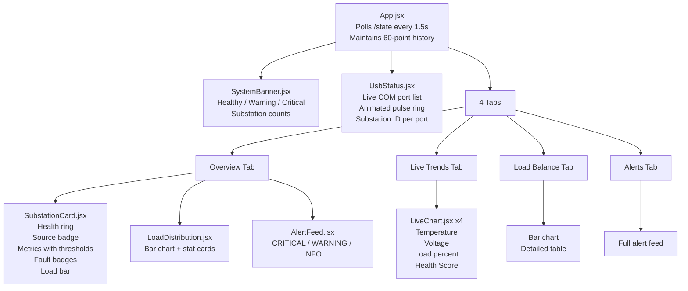

### Substation card features

- **SVG health score ring** — animates smoothly, color matches status
- **Data source badge** — `📱 Android ADB` / `🔌 USB Sensor` / `⚙ Simulated`
- **Metric rows** — voltage, current, temperature, harmonics with threshold colors
- **Blinking anomaly badge** — appears when ML detects anomaly
- **Phone data strip** — shows raw battery V, temp, level when using ADB
- **Load bar** — actual % vs target % with color coding
- **Fault badges** — HIGH (red) and MEDIUM (yellow) fault type labels

---

## 17. Project Structure

```
industrial-smart-grid-ai/
│
├── substations/                       # Substation clients
│   ├── substation_client.py           # Main entry — USB / ADB / simulate
│   ├── usb_substation_client.py       # USB serial (Arduino/ESP32)
│   ├── adb_substation_client.py       # Android phone via ADB
│   ├── universal_hw_client.py         # Auto-detects ADB or serial
│   ├── telemetry_generator.py         # Synthetic telemetry with drift
│   └── fault_simulator.py             # 5 fault types for simulation
│
├── server/                            # AI server core
│   ├── socket_server.py               # TCP server + 11-step AI pipeline
│   ├── telemetry_manager.py           # Thread-safe state + rolling history
│   └── connection_handler.py          # Per-client TCP handler
│
├── ml/                                # Live pipeline wrappers
│   ├── anomaly_detector.py            # Unified detector (wraps ml_models/)
│   └── health_score.py                # Rule-based health scoring
│
├── ml_models/                         # Full ML model suite
│   ├── anomaly_detection/
│   │   ├── isolation_forest.py        # LIVE — IsolationForest + scaler + save/load
│   │   ├── lstm_anomaly_detector.py   # LIVE — sequence/trend detection
│   │   ├── autoencoder.py             # Available — numpy autoencoder
│   │   ├── advanced_lstm_autoencoder.py  # TF LSTM (Python 3.10/3.11)
│   │   └── model_trainer.py           # Train + evaluate all models
│   ├── load_balancing/
│   │   ├── load_optimizer.py          # LIVE — optimal load distribution
│   │   ├── redistribution_engine.py   # LIVE — smooth transitions + cooldown
│   │   └── reinforcement_agent.py     # Available — Q-Learning agent
│   ├── prediction/
│   │   ├── health_score_model.py      # LIVE — GradientBoosting health scorer
│   │   ├── overload_predictor.py      # LIVE — RandomForest overload risk
│   │   └── transformer_failure_predictor.py  # LIVE — failure probability
│   └── saved_models/                  # Trained model files (auto-created)
│
├── smart_grid/                        # Grid control logic
│   ├── load_balancer.py               # Basic load redistribution
│   ├── self_healing_engine.py         # Gradual load recovery
│   ├── fault_isolation.py             # Rule-based fault classification
│   └── substation_manager.py          # Aggregated state manager
│
├── feature_engineering/               # 42-feature extraction
│   ├── feature_pipeline.py            # Orchestrator
│   ├── statistical_features.py        # Mean, std, rate-of-change
│   ├── harmonic_analysis.py           # THD, power factor
│   ├── phase_unbalance.py             # Voltage instability
│   └── fft_analysis.py                # Frequency-domain features
│
├── alerts/                            # Alert system
│   ├── alert_manager.py               # Thread-safe store + dispatch
│   ├── email_alert.py                 # SMTP email
│   ├── slack_alert.py                 # Slack webhook
│   ├── sms_alert.py                   # Twilio SMS
│   └── critical_shutdown.py           # Emergency shutdown protocol
│
├── explainability/                    # AI explainability
│   ├── shap_explainer.py              # SHAP feature contributions
│   ├── feature_importance.py          # Permutation importance
│   └── root_cause_engine.py           # Root cause + recommendations
│
├── api/                               # FastAPI backend
│   ├── main.py                        # App + all 5 routers registered
│   ├── routes/
│   │   ├── telemetry_routes.py
│   │   ├── anomaly_routes.py
│   │   ├── load_balancing_routes.py
│   │   ├── prediction_routes.py       # 7 endpoints including new models
│   │   └── usb_routes.py
│   ├── services/
│   │   ├── smart_grid_service.py
│   │   ├── prediction_service.py      # All 5 ML models exposed
│   │   └── alert_service.py
│   └── schemas/
│
├── dashboard/
│   ├── app.py                         # Streamlit dashboard
│   └── frontend/                      # React dashboard
│       └── src/
│           ├── App.jsx
│           └── components/
│               ├── SubstationCard.jsx
│               ├── LiveChart.jsx
│               ├── LoadDistribution.jsx
│               ├── AlertFeed.jsx
│               ├── SystemBanner.jsx
│               └── UsbStatus.jsx
│
├── shared/
│   ├── config.py                      # All tuneable parameters
│   ├── schemas.py                     # Shared Pydantic models
│   └── utils.py                       # Logging, validation helpers
│
├── database/
│   ├── db_manager.py                  # Optional PostgreSQL persistence
│   └── schema.sql                     # DB schema
│
├── monitoring/
│   └── metrics_collector.py           # Prometheus metrics (optional)
│
├── start_all.py                       # Single-machine launcher
├── list_usb_ports.py                  # List available COM ports
├── setup_adb.py                       # Download ADB automatically
├── requirements.txt                   # Pinned Python dependencies
├── docker-compose.yml
├── Dockerfile.backend
├── Dockerfile.frontend
└── .env                               # Credentials (never committed)
```

---

## 18. Configuration

All parameters in `shared/config.py` — change once, applies everywhere:

```python
# ── Network ───────────────────────────────────────────────────────────
SERVER_PORT = 9999          # TCP socket for telemetry
API_PORT    = 8000          # FastAPI REST

# ── Normal operating ranges ───────────────────────────────────────────
VOLTAGE_MIN = 220.0         # V
VOLTAGE_MAX = 240.0
CURRENT_MIN = 10.0          # A
CURRENT_MAX = 20.0
TEMP_MIN    = 50.0          # °C
TEMP_MAX    = 75.0
HARMONIC_MIN = 1.0          # %
HARMONIC_MAX = 5.0
LOAD_MIN    = 20.0          # %
LOAD_MAX    = 60.0

# ── Health scoring ────────────────────────────────────────────────────
HEALTH_HEALTHY_MIN = 80     # score >= 80 → Healthy
HEALTH_WARNING_MIN = 50     # score >= 50 → Warning (below = Critical)

# ── Load balancing ────────────────────────────────────────────────────
CRITICAL_LOAD_FLOOR = 10.0  # minimum load for critical substation

# ── Self-healing ──────────────────────────────────────────────────────
RECOVERY_THRESHOLD = 70     # health score to start recovery
RECOVERY_STEP      = 5.0    # % load restored per cycle
HEALING_INTERVAL   = 10     # seconds between healing checks

# ── Alerts ────────────────────────────────────────────────────────────
ALERT_COOLDOWN_SEC = 30     # minimum seconds between same-substation alerts
MAX_ALERT_HISTORY  = 100    # maximum alerts stored in memory

# ── ML ────────────────────────────────────────────────────────────────
ISOLATION_FOREST_CONTAMINATION    = 0.1
ISOLATION_FOREST_TRAINING_SAMPLES = 500
MODEL_SAVE_PATH = "ml_models/saved_models"
HISTORY_WINDOW  = 20        # rolling history length per substation

# ── Telemetry ─────────────────────────────────────────────────────────
TELEMETRY_INTERVAL = 1.5    # seconds between packets
```

---

## 19. Docker Deployment

```bash
# Build and start backend + frontend
docker-compose up --build
```

Services started:

| Service | Port | Description |
|---|---|---|
| backend | 8000 | FastAPI + socket server (9999) |
| frontend | 5173 | React dashboard |

Then run substation clients on other devices pointing to the server IP:

```bash
python substations/substation_client.py --id S1 --host <SERVER_IP>
```

---

## 20. Tech Stack

| Layer | Technology | Version |
|---|---|---|
| Substation clients | Python, pyserial, ADB | pyserial 3.5 |
| Communication | TCP sockets, JSON newline-delimited | — |
| Anomaly detection | scikit-learn IsolationForest | 1.8.0 |
| Sequence detection | numpy LSTM predictor | numpy 2.3.5 |
| Overload prediction | RandomForestClassifier | sklearn 1.8.0 |
| Failure prediction | LogisticRegression | sklearn 1.8.0 |
| Health scoring | GradientBoostingRegressor | sklearn 1.8.0 |
| Load optimization | Weighted allocation + Q-Learning | — |
| Explainability | SHAP TreeExplainer | shap |
| Backend API | FastAPI + uvicorn | 0.136.1 / 0.47.0 |
| Data validation | Pydantic | 2.13.4 |
| Frontend | React 19, Vite 8, Tailwind CSS, Recharts | — |
| Alt dashboard | Streamlit | 1.57.0 |
| Model persistence | joblib | 1.5.2 |
| Database | PostgreSQL / TimescaleDB (optional) | — |
| Monitoring | Prometheus (optional) | — |
| Deployment | Docker, docker-compose | — |

---

## Fault Types Reference

| Fault | Trigger Condition | Severity | Likely Root Cause |
|---|---|---|---|
| Overheat | Temperature > 85°C | HIGH | Cooling failure, overloaded windings |
| Voltage Sag | Voltage < 205V | HIGH | Heavy load connection, upstream fault |
| Voltage Surge | Voltage > 255V | MEDIUM | Load shedding, lightning strike |
| Overload | Load > 80% | HIGH | Demand spike, load transfer from failed sub |
| Harmonic Distortion | Harmonics > 8% | MEDIUM | VFDs, non-linear loads, capacitor resonance |
| Overcurrent | Current > 25A | HIGH | Short circuit, ground fault, motor starting |

---

*Built with Python 3.14.3 · scikit-learn 1.8.0 · React 19 · FastAPI 0.136.1 · numpy 2.3.5*
